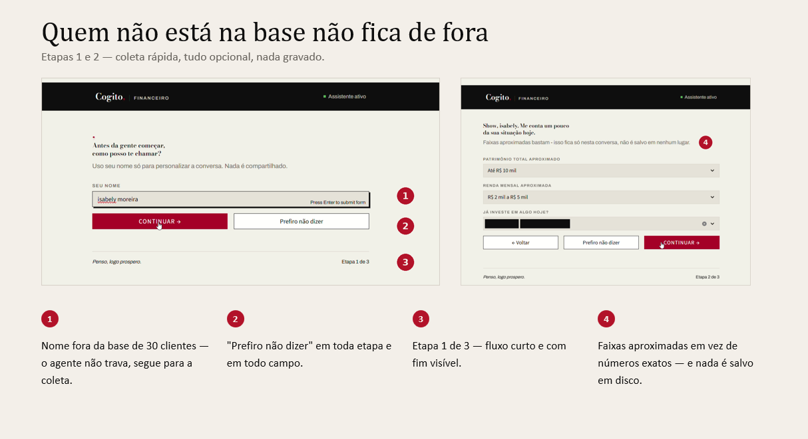
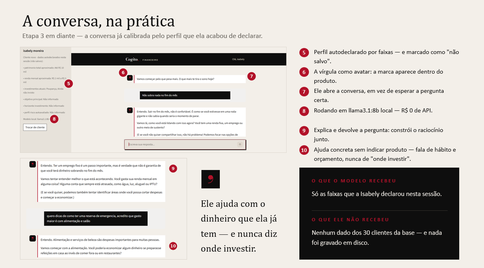

# Agente Financeiro — Cogito, Financeiro

Protótipo de uma assistente virtual de **educação financeira** — não de consultoria de investimentos. O objetivo não é dar respostas prontas nem recomendar produtos, e sim ajudar pessoas iniciantes ou intermediárias (autônomos, MEIs, pequenos empresários, curiosos no assunto) a entender como o mercado financeiro funciona, para que tomem as próprias decisões com mais autonomia e confiança.

---

## Como funciona, na prática

### Quem não está na base não fica de fora

Etapas 1 e 2 — coleta rápida, tudo opcional, nada gravado.



Se o nome não está entre os 30 clientes da base, o agente não trava: a pessoa segue para duas telas curtas e informa o perfil por **faixas aproximadas**, nunca por números exatos. "Prefiro não dizer" está disponível em toda etapa e em todo campo, e nada é salvo em disco — os dados existem apenas durante a sessão do navegador.

### A conversa, já calibrada pelo perfil



O agente abre a conversa em vez de esperar a pergunta certa, explica e devolve a pergunta para construir o raciocínio junto, e dá ajuda concreta sobre hábito e orçamento — **sem nunca indicar produto ou dizer onde investir**.

Rodando em `llama3.1:8b` local: R$ 0 de custo de API.

**O isolamento de dados na prática:** o modelo recebe apenas as faixas que a própria pessoa declarou naquela sessão. Nenhum dado dos 30 clientes da base chega até ele — o filtro acontece em `dados_cliente.py`, antes da chamada ao modelo, o que torna a garantia independente do comportamento do LLM.

---
## Estrutura

```
├── agente.py            # agente via API
├── agente_local.py      # agente via Ollama local (llama3.1:8b)
├── streamlit_app.py     # interface web de chat
├── dados_cliente.py     # identificação e isolamento de dados por cliente
├── docs/                # documentação completa
└── assets/              # identidade visual
```

## Como usar

Precisa dos arquivos `clientes.csv`, `perfil_investidor.json`, `historico_atendimentos.csv` e `produtos_financeiros.json` na mesma pasta — eles ficam só localmente, fora do repositório. As duas opções abaixo rodam sem chave de API, com um modelo aberto local via Ollama.

### Opção 1 — Agente local com Ollama (`agente_local.py`), sem custo de API

Mesma lógica de identificação/isolamento de `dados_cliente.py`, gerando as respostas com um modelo aberto rodando localmente (sem chave, sem custo, sem internet depois de baixado).

1. Instale o [Ollama](https://ollama.com) e baixe o modelo (`llama3.1:8b`, ~4,7 GB — segue melhor o contexto/system prompt que modelos menores como `llama3.2:3b`, mas exige mais RAM):
   ```bash
   ollama pull llama3.1:8b
   ```
2. Instale as dependências e rode:
   ```bash
   pip install -r requirements.txt
   python agente_local.py
   ```

### Opção 2 — Interface web (`streamlit_app.py`), marca "Cogito, Financeiro"

Mesma identificação/isolamento e mesmo modelo local (Ollama) da Opção 1, só que numa interface de chat no navegador em vez do terminal, com a identidade visual "Cogito, Financeiro": fundo creme predominante, texto quase-preto, vermelho carmim (`#B21229`) só como acento (no máximo três lugares por tela), cinza só para estado desabilitado, sem cantos arredondados, título em Bodoni Moda e corpo em Archivo.

```bash
pip install -r requirements.txt
streamlit run streamlit_app.py
```

Abre em `http://localhost:8501`. O tema (cores, fonte base) fica em [`.streamlit/config.toml`](./.streamlit/config.toml); a tipografia e os detalhes visuais do cabeçalho/chat ficam no bloco de CSS no topo de [`streamlit_app.py`](./streamlit_app.py).

## Sobre os dados

Este repositório **não inclui** os arquivos de dados usados como base de conhecimento (`produtos_financeiros.json`, `perfil_investidor.json`, `clientes.csv`, `historico_atendimentos.csv`, `transacoes.csv`). Eles contêm dados fictícios de clientes (nome, renda, patrimônio, perfil de risco, histórico de atendimento) gerados para prototipagem, e ficam de fora do repositório para não expor esse formato de dado publicamente — mesmo sendo sintético.

O system prompt já foi desenhado considerando esses arquivos: trata `produtos_financeiros.json` como conteúdo de referência público, e os demais como dado pessoal sujeito a regras de identificação e isolamento por cliente (veja a seção "Identificação e isolamento do cliente" no system prompt).

## Documentação

Documentação completa do projeto na pasta [`docs/`](docs/):

| Documento | Conteúdo |
|---|---|
| [01 — Documentação do agente](docs/01-documentacao-agente.md) | Arquitetura e decisões de projeto |
| [02 — Base de conhecimento](docs/02-base-conhecimento.md) | Fontes e conteúdo que sustentam as respostas |
| [03 — Prompts](docs/03-prompts.md) | System prompt e estratégias anti-alucinação |
| [04 — Métricas](docs/04-metricas.md) | Avaliação de qualidade das respostas |
| [05 — Pitch](docs/05-pitch.md) | Apresentação do produto |

## Regras principais do agente

- Nunca recomenda comprar, vender ou manter um ativo/produto específico.
- Nunca monta carteira nem sugere alocação para o caso pessoal de alguém.
- Sempre explica o "porquê", não só o "o quê" — o objetivo é formar autonomia, não dependência do agente.
- Admite quando não sabe algo, em vez de inventar dados ou números.
- Não lida com dados sensíveis (CPF, senha, dados bancários) nem com dados de outros clientes da base.
